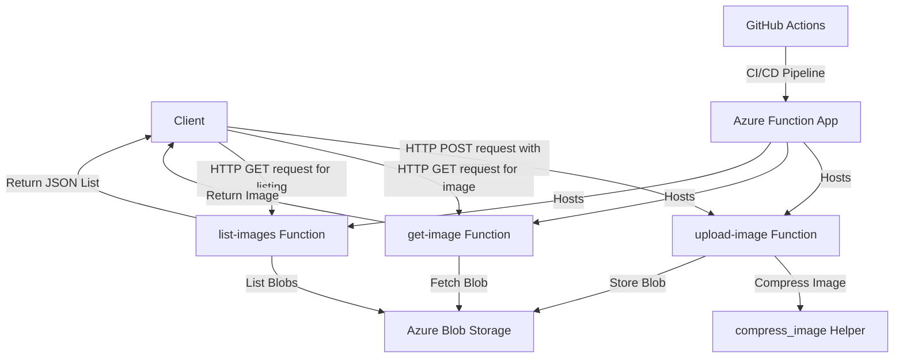

# Architecture Overview

This document describes the architecture of the Image Processor Function App, detailing the components, data flow, and integration points.

## Architecture Diagram

## Component Description

### Client Applications
External applications or users that interact with the Function App through HTTP requests.

### Azure Functions
- **upload-image**: Receives images via HTTP POST, processes them, and stores them in Blob Storage
- **get-image**: Retrieves images from Blob Storage via HTTP GET requests
- **list-images**: Returns a list of all available images in the storage container

### Helper Functions
- **compress_image**: Compresses uploaded images to ensure they don't exceed maximum size
- **ensure_container_exists**: Creates the storage container if it doesn't exist

### Azure Blob Storage
Persistent storage for the compressed images.

### CI/CD Pipeline
GitHub Actions workflow that automates the deployment process to Azure.

## Data Flow

1. **Image Upload Process**:
   - Client sends HTTP POST with an image file
   - Function app validates and compresses the image
   - Compressed image is stored in Azure Blob Storage
   - Success/failure response is sent to the client

2. **Image Retrieval Process**:
   - Client sends HTTP GET request with image name
   - Function app retrieves the image from Azure Blob Storage
   - Image is returned to the client with appropriate MIME type

3. **Image Listing Process**:
   - Client sends HTTP GET request to list-images endpoint
   - Function app retrieves all blob names from the container
   - JSON list of available images is returned to the client
